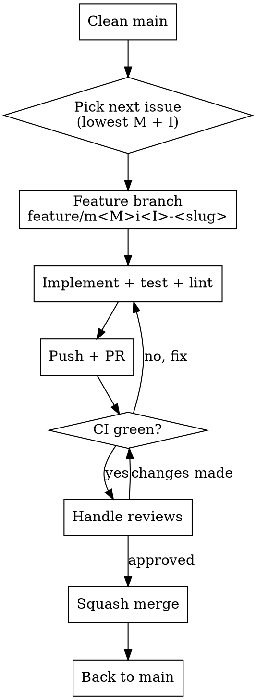

# Forklift Issue Picker

## Overview

Issues are labelled `MxIxx` where `Mx` = milestone number and `Ixx` = issue number. Always pick the open issue with the **lowest milestone number**, then the **lowest issue number** within that milestone.

## Workflow



## Steps

### 1. Start from clean main
```bash
git fetch origin
git checkout main
git pull origin main
```

### 2. Pick the next issue
```bash
gh issue list --state open --json number,title,milestone --jq '
  sort_by(.milestone.number, .number) | .[0] | {number, title}
'
```

### 3. Create feature branch
```bash
git checkout -b feature/m<M>i<I>-<short-kebab-description>
```

### 4. Implement
- Read the issue body and any referenced milestone docs in `docs/superpowers/`
- Write code + unit tests
- Run checks:
  ```bash
  composer lint && composer test
  ```

### 5. Push and create PR
```bash
git push -u origin <branch>

gh pr create \
  --title "M<M>I<I>: <issue title>" \
  --body "## Summary\n\n...\n\nCloses #<N>"
```

### 6. CI and reviews
```bash
gh pr checks --watch
```
- Fix CI failures on the branch
- Read review comments with `gh pr view` or the review tool
- Address all feedback, reply with explanations

### 7. Merge
```bash
gh pr merge --squash --subject "M<M>I<I>: <title>"
```

### 8. Loop
```bash
git checkout main && git pull origin main
# → back to step 1
```

## PR conventions

| Field | Format |
|-------|--------|
| Title | `M<M>I<I>: <issue title>` |
| Branch | `feature/m<M>i<I>-<kebab-slug>` |
| Body | Summary table + acceptance criteria checklist + `Closes #N` |
| Merge | Squash, subject same as PR title |

## Common pitfalls

- Forgetting to push the branch before creating PR
- Leaving uncommitted changes when creating PR
- Not watching CI after pushing fixes
- Branch name not matching the issue it solves
